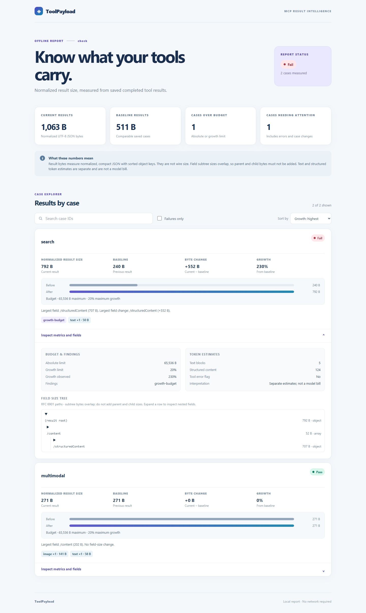
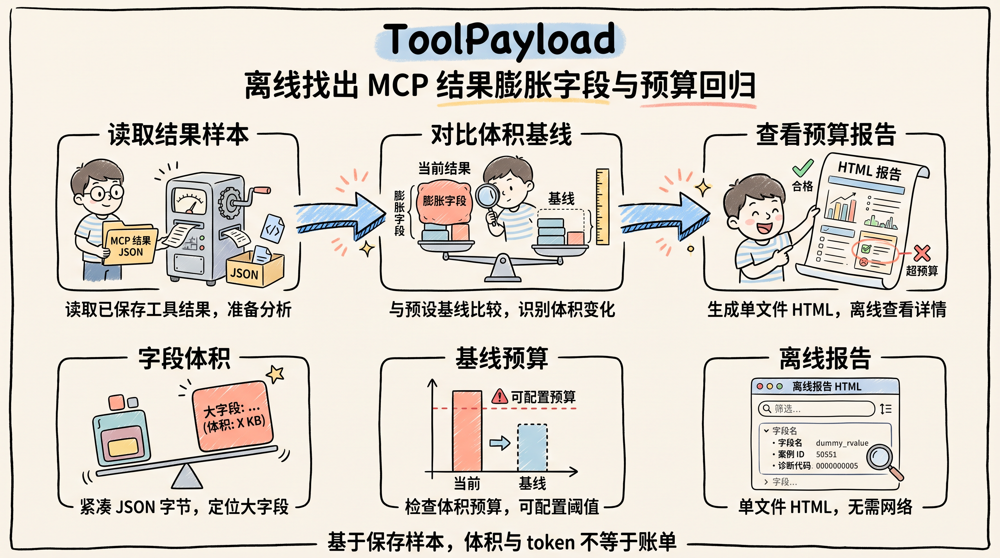

# ToolPayload

### Offline size budgets for MCP tool results

**Find the fields bloating saved MCP results, compare them with a baseline, and catch size regressions in CI with a self-contained HTML report.**

English | [简体中文](README.zh-CN.md)

[Install and demo](#install-from-source) · [Results and budgets](#saved-results-and-budgets) · [Measurement limits](#what-the-measurements-mean)

ToolPayload is an offline CLI for maintainers of [Model Context Protocol (MCP) tools](https://modelcontextprotocol.io/specification/2026-07-28/server/tools). Analyze saved tool results, find the fields that account for their size, and enforce configurable response-size budgets in CI.

- Measure normalized JSON bytes and identify the largest fields.
- Compare fixtures with a saved baseline and fail CI on budget violations.
- Explore a self-contained HTML report with filtering, sorting, and field details.

Analyze saved JSON entirely offline and configure size budgets for your project. Byte and token measurement definitions are documented in [What the measurements mean](#what-the-measurements-mean).





## Install from source

Requires Node.js 22 or newer, npm, and Git. The first dependency installation needs network access or a populated npm cache.

```sh
git clone https://github.com/cloudwallker/toolpayload.git
cd toolpayload
npm ci
npm run build
npm run demo
```

You can also download the repository as a ZIP and run the npm commands in the extracted directory.

The demo writes `artifacts/baseline.json`, `artifacts/demo-report.json`, and a self-contained `artifacts/demo-report.html`. Open the HTML file in a browser. Its `search` case deliberately fails a 20% growth budget because the current result includes a verbose retrieval trace; `multimodal` stays unchanged. The demo script treats that expected failure as a successful demonstration.

Use the built CLI directly to inspect a result or produce your own baseline and report:

```sh
node dist/cli.js analyze examples/baseline-search.json --format text
node dist/cli.js snapshot --config examples/baseline-config.json --out artifacts/my-baseline.json
node dist/cli.js check --config examples/current-config.json --baseline artifacts/my-baseline.json --format html --out artifacts/my-report.html
```

The last command exits with code 1 for the intentionally bloated fixture. The HTML and JSON report formats can be saved with `--out FILE`; `--format text|json|html` selects the rendering. `analyze FILE` accepts the same format and output options. `snapshot` refuses to overwrite an existing baseline unless `--force` is supplied. `check` never modifies its baseline and writes the requested report even when a budget fails.

## Install a local npm package

After installing the source dependencies, create a package in the repository root:

```sh
npm pack
```

In a separate npm project, install the resulting file and invoke the CLI. Replace the example path with your tarball's location:

```sh
npm install /path/to/toolpayload-0.1.0.tgz
npx --no-install toolpayload --help
npx --no-install toolpayload analyze response.json --format html --out report.html
```

This installs the CLI locally; use `npx --no-install` or an npm script to run it. A local install does not add the command to your shell's global `PATH`. No npm registry publication is needed, but the first dependency installation may need network access or an existing npm cache. Once installed, analysis and HTML reports run entirely offline.

## Saved results and budgets

Save either the **result object** from a completed `tools/call` or its JSON-RPC response envelope (`{"jsonrpc":"2.0","id":1,"result":{...}}`). ToolPayload measures the inner result in both cases. It must have a `content` array and/or its own `structuredContent` property (which may be `null`). An optional `resultType` must be `complete`. JSON-RPC `error` responses are invalid inputs. See [the compact result](examples/baseline-search.json), [the verbose result](examples/current-search.json), and [the mixed text/image result](examples/multimodal-result.json).

Configuration uses schema version 1. Case IDs must be unique. Each `file` path is resolved relative to the configuration file, so the checked-in examples work from any current directory. The optional top-level `budget` supplies defaults; a case's `budget` overrides those values for that case. The default starting budgets are 65,536 normalized result bytes and 20% growth.

```json
{
  "schemaVersion": 1,
  "budget": { "maxResultBytes": 65536, "maxGrowthPercent": 20 },
  "cases": [
    { "id": "search", "file": "current-search.json" },
    { "id": "multimodal", "file": "multimodal-result.json" }
  ]
}
```

Run `snapshot` on representative approved results and commit the baseline along with your fixtures. Run `check` against current fixtures in CI. An absolute budget or growth budget fails only when its value is **strictly greater** than the configured threshold. A tool result with `isError: true`, an added case, or a missing case also fails. Growth from zero bytes to zero is 0%; growth from zero to a positive size fails the growth budget, with no finite percentage to display.

Exit codes: `0` means success (or no failing check findings), `1` means a check finding, and `2` means invalid input/configuration or an incompatible baseline. Baselines and reports carry `schemaVersion: 1`, `metricVersion: 1`, and `tokenizer: "cl100k_base"` so incompatible metrics are rejected rather than silently compared.

## What the measurements mean

`resultBytes` is the UTF-8 byte length of the **compact JSON serialization of the result** after recursively sorting object keys in JavaScript's UTF-16 lexical order. Array order is preserved; numbers follow normal JavaScript JSON serialization. `_meta` is included. Input whitespace and object key order do not change this metric. It is **not transport bytes**: it excludes the JSON-RPC envelope and any transport framing. Field-tree sizes describe subtrees, so parent and child values overlap and must not be summed.

`textTokens` uses `cl100k_base` on each text content block and embedded text resource, adding the per-block counts. `structuredTokens` counts the compact, sorted `structuredContent` JSON separately when present. These are distinct views and must not be added to claim a model bill. Images and other binary payloads contribute bytes but are not counted as text tokens. Unknown content block types receive byte measurements and a warning.

This is sample-based measurement, **not a production token bill**. A model's context usage depends on the client, prompt assembly, model tokenizer, and any transformation of tool output. ToolPayload does not decode JSON hidden inside strings. Input files are limited to 10 MiB and 100 nesting levels, counted from the complete input root (so a JSON-RPC envelope uses one level). A generated baseline over 10 MiB exits with code 2; split a large case collection into smaller configurations. Reports and baselines omit original response values, but **field names, case IDs, paths, and diagnostic codes are not anonymized**; review them before sharing artifacts.

## Development

```sh
npm run typecheck
npm run build
npm run demo
```

The demo uses checked-in example tool results and writes its HTML report to the ignored `artifacts/` directory.

MIT licensed; see [LICENSE](LICENSE).

## Interface

Offline MCP result-size budget reports with visible case-search labels, keyboard-accessible field trees, readable metrics, and responsive report layouts.
